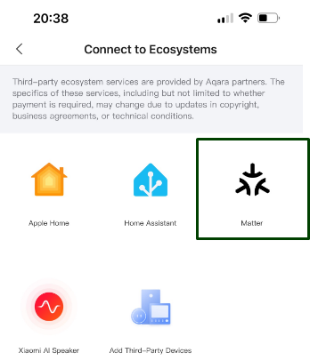
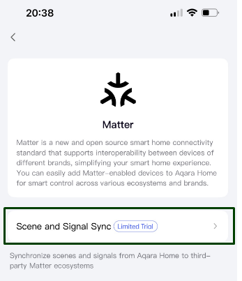
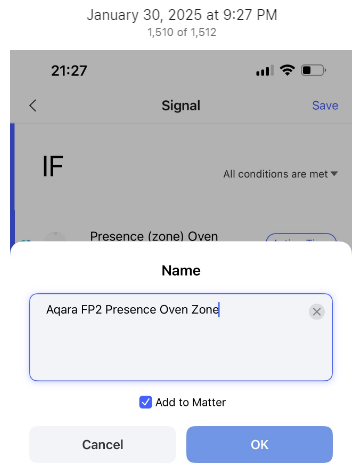
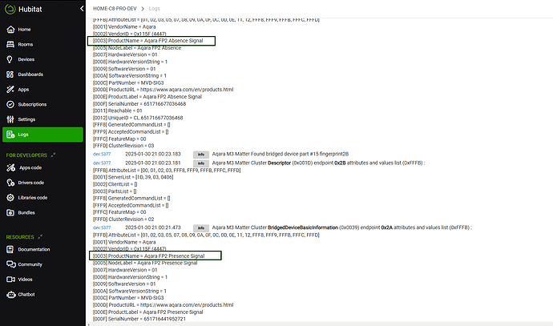
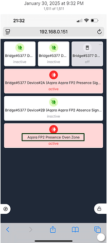
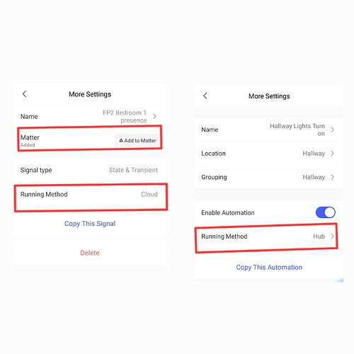

# Aqara Signals

Applies to: 1.9.0 | Last verified: 2026-08-21 | Status: Current

A **Signal** is Aqara's own term for a rule defined in the Aqara Home app — "if this condition is
met" — that can optionally be synced out to Matter as its own bridged device. It is how
non-standard Aqara behavior (for example, an FP2 presence zone, which is not itself a Matter device
type) gets a Matter identity that Hubitat can subscribe to. This page documents what the community
thread shows about creating and using Signals; it is not Aqara's own documentation.

Labels: **Confirmed** — reported working with MAB. **Unknown** — no MAB test found. See the
[compatibility overview](../compatibility/overview.md).

## What a Signal is

Aqara's Home app has a feature called **Scene and Signal Sync**, reached from **Profile → Third-party
ecosystems → Matter**. It is marked "Limited Trial" as of the screenshots below (January 2025).
**Scenes** sync Aqara automations outward; **Signals** sync conditions — the state of something,
such as an FP2 zone's presence, or a device's on/off status — so that it can be read as a Matter
device by a third-party ecosystem.

## Creating a Signal

1. In the Aqara Home app, open the automation editor and build the condition you want to expose
   (for example, `Presence (zone) Oven` — "all conditions are met").
2. Save it, giving it a descriptive name — this name becomes the Matter `ProductName`/`NodeLabel`
   that MAB imports. For example, `Aqara FP2 Presence Oven Zone`.
3. Toggle **Add to Matter**.

Source: [community thread, post #237](https://community.hubitat.com/t/-/135252/237),
kkossev, 2025-01-30.

## What it looks like on the hub and in Hubitat

A Signal shows up in the Matter hub's `BridgedDeviceBasicInformation` cluster (`0x0039`) like any
other bridged device, with a `ProductName` derived from the name you gave it in step 2 above — for
example `Aqara FP2 Presence Signal` / `Aqara FP2 Absence Signal` for a presence/absence pair.

**No driver change is needed for this** — kkossev confirmed it directly: *"No changes in this
driver are needed."* MAB's existing NodeLabel import picks up the Signal's name normally, and the
resulting child device works as a plain sensor with active/inactive state. Per-zone Signals appear
as separate child device tiles:

Source: [post #238](https://community.hubitat.com/t/-/135252/238), kkossev, 2025-01-30; confirmed
independently by [post #239](https://community.hubitat.com/t/-/135252/239), iEnam, 2025-01-30 —
*"I have now managed to create signals for my FP2 sensors as per your instructions! The child
device with 'Presence' state shows both active and inactive motion states in your driver."*

## The cloud-dependency caveat

**A Signal's "Running Method" is Cloud, not Hub** — unlike an ordinary Aqara Automation, which runs
locally on the hub. This is set when the Signal is created and is not something MAB or Hubitat can
change.

The practical effect was demonstrated, not just theorized: during a WAN outage, a Signal-derived
FP2 presence child device stopped updating, while a directly-bridged device (an Aqara Ceiling Light
T1) kept responding to Hubitat locally.

> "Unfortunately, there is a cloud dependency somewhere in Aqara M3 hub or in the FP2 sensor. I have
> a problem with my router WAN Internet access at the moment, and the FP2 presence sensor is not
> working anymore. At the same time, I can still control the Aqara Ceiling light T1 from Hubitat,
> i.e. the local Matter connection between the Aqara M3 and HE is working offline for some Aqara
> devices, but not working for some others…"
>
> — kkossev, [post #240](https://community.hubitat.com/t/-/135252/240), 2025-01-30

> "Yeah, there is cloud dependency which is a shame 😐"
>
> — iEnam, [post #241](https://community.hubitat.com/t/-/135252/241), 2025-01-30

> "No, the Matter connection to FP2 requires Aqara M3 hub."
>
> — kkossev, [post #243](https://community.hubitat.com/t/-/135252/243), 2025-01-31, answering
> whether it works with just the FP2 sensor (without the M3 hub in the loop)

**If you plan to automate on a Signal-derived device, know that it depends on the Aqara hub's own
Internet connectivity, not just your local network.** A directly-bridged Matter device on the same
hub is not affected the same way.

## Discovery and removal

Newly created Signals do not appear as Hubitat child devices automatically:

1. Run **Discover All** on the MAB bridge device.
2. Wait for discovery to finish.
3. Refresh the bridge device's web page (**F5**) — existing browser sessions do not update on
   their own.

Existing child devices are preserved across a rediscovery; only genuinely new devices are added.
Removing a Signal on the Aqara side does **not** remove its Hubitat child device automatically —
you must remove it manually.

> "New devices (including Aqara-specific 'signals') should be discovered and added as child devices
> after clicking on the 'Discover All' command button, and waiting the discovery process to finish.
> All the existing devices should be preserved, any new devices should be added automatically. If
> you remove a device at the bridged hub, the child device will not be deleted automatically in
> this driver, you must remove it manually. Make sure you refresh the bridge device web page (F5)
> after running a new discovery command."
>
> — kkossev, [post #368](https://community.hubitat.com/t/-/135252/368), 2026-05-13, answering a
> report ([post #367](https://community.hubitat.com/t/-/135252/367), user6870) that a Signal added
> after initial setup did not appear until the M2 hub device was removed and re-added

## Which Aqara devices need this

**Confirmed:** FP2 presence-sensor zones, via Signals synced from an M3 or M2 hub. This is Advanced
Matter Bridging, not a direct export of the FP2 device — the FP2 itself has no standard Matter
device type for presence zones. See also the [Aqara bridge page](aqara.md#community-confirmed-devices).

**Open — not evidenced in this thread:** whether any Aqara device needs the
[Matter Custom Component Signal](../drivers/signal.md) driver (the one that turns a momentary
report into a button press) rather than an ordinary Motion Sensor. Every FP2 case documented above
is state-based (active/inactive) and works with a plain sensor — nothing in this thread demonstrates
a momentary/button-style Signal. [HUB-108](https://smartifysystems.atlassian.net/browse/HUB-108)
originates from a *different* thread, about the Aqara G41O doorbell, which has not yet been
reviewed for this page.

## Sources

All from the [MAB community thread](https://community.hubitat.com/t/-/135252/1), topic 135252:
[#237](https://community.hubitat.com/t/-/135252/237)–[#243](https://community.hubitat.com/t/-/135252/243)
(kkossev, iEnam, BorrisTheCat, 2025-01-30 to 2025-01-31) and
[#367](https://community.hubitat.com/t/-/135252/367)–[#368](https://community.hubitat.com/t/-/135252/368)
(user6870, kkossev, 2026-05-13). Cross-checked against the full 447-post thread on 2026-08-21 —
these are the only posts that mention "signal" in the Aqara sense (two further hits, #342/#343, are
an unrelated use of the word "signal" in an HPM packaging discussion).

## See also

- [Aqara](aqara.md)
- [Matter Custom Component Signal driver](../drivers/signal.md)
- [Compatibility matrix](../compatibility/matrix.md)
- [Aqara Advanced Matter Bridging — current Matter Bridge hub list](https://www.aqara.com/en/explore/introducing-advanced-matter-bridging/)
