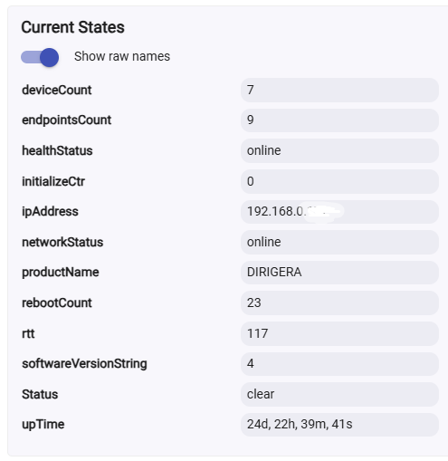

# Commands and states

Applies to: 1.9.0 | Last verified: 2026-07-27 | Status: Current

This page describes the buttons and the Current States shown on the **parent** Matter Advanced
Bridge device page. Child devices have their own commands — see the individual
[driver pages](../drivers/index.md).

## Commands

### _DiscoverAll

Starts the discovery process — the bridge's own capabilities, the endpoints it exposes, the child
devices, and the subscriptions. It takes no options: one click runs the whole sequence.

Discovery always begins by pinging the bridge, and continues only if the bridge answers.

### Get Info

Collects extended information for one endpoint and prints it to the live logs. The endpoint is
entered in decimal, or in hex with a `0x` prefix. **Endpoint 0 is the bridge itself**, and is the
default.

### Identify

Asks the bridge to identify itself for 10 seconds — typically a blinking LED. Not every bridge
implements it.

### Load All Defaults

The panic button. Deletes all preferences, Current States, scheduled jobs, and State Variables,
resets every internal variable to its default, and restarts the automatic jobs such as the health
check. **Existing child devices are not deleted.**

Use it if you think something has gone wrong. You will have to run `_DiscoverAll` again afterwards.

### Ping

Sends a simple command to the bridge and measures the round-trip time in milliseconds. The quickest
way to tell whether the hub can still talk to the bridge.

### Refresh

Re-reads all subscribed attributes. Refresh overrides the skipping of duplicate attribute values, so
every value is reported even if it has not changed, and the resulting log lines carry a `[refresh]`
tag. Log lines produced during discovery are tagged `[discovery]` in the same way.

Child devices that are **disabled** in Hubitat are skipped. If nothing has been discovered yet,
Refresh logs a warning instead — run `_DiscoverAll` first.

### Re Subscribe

Re-sends the subscription commands to the bridge. Use it when child devices have stopped receiving
updates. It requires Hubitat platform **2.3.9.186 or newer**; on anything older it only
unsubscribes, and logs a warning.

### Utilities

Advanced commands for debugging, entered as text. The Hubitat driver UI has no way to hide them,
which is why they appear on the device page alongside the everyday buttons. Type `help` to list them
in the logs; an unrecognised entry lists them too.

Each is typed as the command name followed by its parameters, separated by spaces —
`readAttribute 0 40 5`, for example.

| Entry | Parameters | What it does |
|---|---|---|
| `help` | — | Logs the list of supported entries. |
| `readAttribute` | endpoint cluster attribute | Reads one attribute and logs the result. |
| `readAttributeSafe` | endpoint cluster attribute | The same, but through the read state machine — use this one if `readAttribute` returns nothing. |
| `subscribeSingleAttribute` | add\|remove\|show endpoint cluster attribute | Adds or removes a single attribute subscription. |
| `unsubscribe` | — | Unsubscribes from everything. The bridge stops sending updates until you re-subscribe. |
| `removeAllSubscriptions` | — | Clears the stored subscriptions and unsubscribes. You must re-discover afterwards. |
| `removeAllDevices` | — | **Deletes every child device.** |
| `minimizeStateVariables` | — | Prunes the State Variables. |
| `resetStats` | — | Resets the statistics counters, including `initializeCtr`. |
| `testMatter` | — | Author's scratch command. No stable behaviour; do not rely on it. |

`removeAllDevices` and `removeAllSubscriptions` destroy work — child device names, room assignments,
and any automations referring to them. There is no confirmation prompt.

Parameters are numbers, and may be entered in decimal or in hex with a `0x` prefix.

### Commands you will not see

- **`test`** exists in the source but is only declared when the driver's internal `_DEBUG` flag is
  set, which it is not in any released build.
- **Initialize** — see below.

## A note on Initialize

**There is no Initialize button, and the hub no longer calls `initialize()` automatically.** The
Initialize capability is deliberately disabled: every call re-subscribes to all Matter attributes
and events, and a hub reboot or a driver update triggering that automatically caused more problems
than it solved. If you are looking for the old "do not click this" button, it is gone — use
**Re Subscribe** instead.

## Current States

**You will not see every state below.** Most are filled in from what the bridge reports about
itself, and bridges differ in what they report — an IKEA DIRIGERA, for example, publishes no
`nodeLabel`, `reachable`, or `totalOperationalHours` at all. A state that never arrives is simply
absent from the device page.

The screenshot above is an IKEA DIRIGERA, with Hubitat's **Show raw names** toggle on so the names
match the table. Values below are examples.

| State | Example | Meaning |
|---|---|---|
| `Status` | `clear` | Important information messages. A message stays for 60 seconds, then reverts to `clear`. |
| `healthStatus` | `online` | `offline` after 3 consecutive failed checks. Polling is every 15 minutes by default — see [Preferences](preferences.md). Also forced to `offline` when the hub itself reports the node as unreachable. |
| `rtt` | `117` | The last round-trip time measurement, in milliseconds. |
| `deviceCount` | `7` | How many child devices were created. Usually lower than `endpointsCount`, because not every bridged device type is supported. |
| `endpointsCount` | `9` | How many endpoints the bridge exposes. One physical device can appear as several endpoints, and therefore as several child devices. |
| `initializeCtr` | `0` | How many times `initialize()` has run since the last statistics reset. A high number indicates a problem. |
| `productName` | `DIRIGERA` | The product name the bridge reports. |
| `softwareVersionString` | `4` | The bridge's firmware version, in whatever form the bridge reports it — this is not always a version number in the usual style. |
| `rebootCount` | `23` | How many times the bridge has rebooted. |
| `upTime` | `24d, 22h, 39m, 41s` | Time since the bridge last booted. |
| `nodeLabel` | `Zemismart M1` | The label the bridge reports for itself. Not reported by every bridge. |
| `reachable` | `01` | Availability as reported by the bridge. `01` is reachable, `00` indicates a problem. Not reported by every bridge. |
| `totalOperationalHours` | `8` | Total hours the bridge reports having been operational. Not reported by every bridge. |
| `battery` | `85` | Battery percentage, only if the bridge exposes a Power Source cluster on its root endpoint. Mains-powered bridges do not report it. |
| `batteryVoltage` | `3.2` | Volts. As above. |

### States that come from Hubitat, not from this driver

Two more appear on the device page. They are maintained by the Hubitat platform's own Matter
handling, so they are present regardless of what the bridge reports:

| State | Example | Meaning |
|---|---|---|
| `ipAddress` | `192.168.0.177` | The bridge's address on your network, as the hub sees it. |
| `networkStatus` | `online` | The platform's own view of the node. When it goes `offline`, the driver forces `healthStatus` offline to match. The reverse does not happen — a platform `online` does not by itself clear `healthStatus`. |

A `state` attribute is also declared by the driver, but nothing populates it, so it never appears.

## Next steps

- [Preferences](preferences.md)
- [Which driver do I get?](../drivers/index.md)
