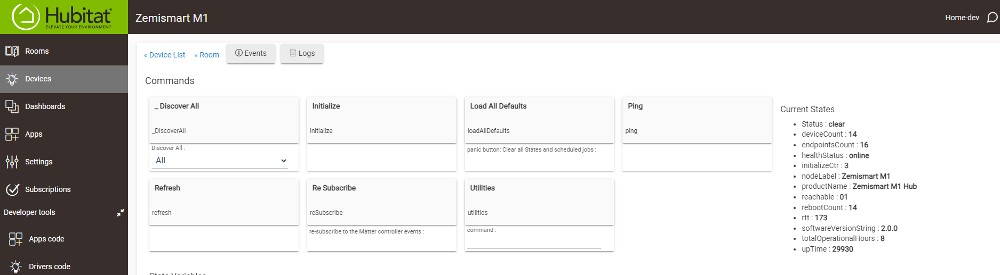

<!-- MIGRATED from wiki page `Matter-Advanced-Bridge-‐-Commands-and-States` at baseline c4000b7 on 2026-07-27.
     Mechanical import: links and images rewritten, text unchanged.
     NOT YET AUDITED against the current release. -->

_(last edited 03/10/2024)_

After discovering the bridged devices, the Advanced Matter Bridge device web page looks like this (version 0.4.5 2023/03/03): 

--------------

### Commands

* **_Discover All** - starts the Matter Bridge discovery process. 

* **Initialize** - called automatically by HE when the hub is rebooted, but also on any Matter error :(  **DO NOT CLICK ON THIS BUTTON**
  * unschedules all previously scheduled periodic jobs.
  * increases the initializeCtr and sends attribute update event
  * only when initialize() is called for the first time - loads all default settings.
  * sends the list of the subscribed attributes to the Matter bridge.
  * restarts the Debug auto-off (24 hours) timer if enabled.
  * restarts the Trace auto-off (30 minutes) timer if enabled.
  * restarts the healhCheck periodic job if enabled.
  * minimizes the State Variables if the option was switched on

* **Load All Defaults** - a panic button :) ... Deletes all settings (preferences), deletes all Current States, deletes all scheduled jobs, deletes all State Variables, initializes all internal variables to their default values, and restarts the automatic jobs (the healthCheck as an example). The existing child devices are **not** deleted.  
**Use this button if you think that something is going wrong**. You will need to re-discover the bridged devices again.

* **Ping** - sends a simple command to the Bridge and measures the round-trip time (RTT) - the time in milliseconds between sending the command and receiving the answer. Useful for checking whether there is a communication to the Bridge or not.

* **Refresh** - reads all subscribed attributes for all child devices. The Refresh command will override the skipping of duplicated attributes values. The logs will be superseded with a [refresh] tag.

* **Re Subscribe** - First, it sends an 'unsubscribe' command to the Matter Bridge, which will effectively disable receiving of any messages from the Matter Bridge. Several seconds later an automatic call of the initialize() method will be invoked by Hubitat hub, which will re-subscribe all attributes. This button is a kind of workaround for Hubitat multiple subscription problems (see the [(Known Issues)](../help/known-issues.md) page.

* **Utilities** - Advanced commands used mostly by the author for debugging. Unfortunately, the very limited UI for Hubitat drivers does not allow hiding it.

-----------

### Current States

* **Status**: clear - shows important information messages. The messages will stay for 60 seconds and then will become 'clear.'
* **deviceCount**: 14 - count the number of the created child devices. This number is usually less than the endpointsCount attribute because not all types of bridged devices are supported by this driver.
* **endpointsCount**: 16 - this is the number of devices exposed from the Matter Bridge. Note that one physical device can be presented by one or more endpoints, respectively, one or more child devices.
* **healthStatus**: online - if a ping() command sent to the bridge fails 3 consecutive times, the bridge will be considered as offline. The default pinging time is every 15 minutes.
* **initializeCtr**: 3 - counts how many times the initialize() function was called since the last statistics reset. A high initializeCtr number is an indication of a problem. 
* **nodeLabel**: Zemismart M1
* **productName**: Zemismart M1 Hub
* **reachable**: 01 - availability status returned by the hub. '01' means the hub is reachable, '00' indicates a problem.
* **rebootCount**: 14 - how many times the Matter hub has been rebooted.
* **rtt**: 173 - the last round-trip time measurement (in milliseconds)
* **softwareVersionString**: 2.0.0
* **totalOperationalHours**: 8
* **upTime**: 29930

------------------

[next page](preferences.md)

Goto [Matter Advanced Bridge - main page](../index.md)
