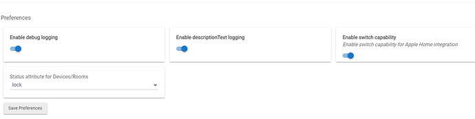
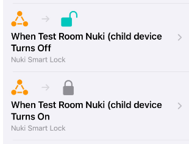

<!-- MIGRATED from wiki page `Matter-Advanced-Bridge-‐-Door-Locks` at baseline c4000b7 on 2026-07-27.
     Mechanical import: links and images rewritten, text unchanged.
     NOT YET AUDITED against the current release. -->

Implementing a second workaround (a virtual switch exposed via HE inbuilt HomeKit integration) now allows fully local lock/unlock control from Hubitat via Apple Home . The trick is to expose the lock device to Apple Home as a switch (not as a lock!) : 

------------

Two simple Automations must be added in Apple Home : 

Summary: 
* Locking and unlocking is performed using HE switch capability, exposed via HE inbuilt HomeKit integration. Hubitat 'lock' command turns the switch attribute on, 'unlock command' turns the switch off. Then the Home Kit automation controls the lock.
* Updating the lock status and the battery percentage is performed instantly, via the Matter interface.

The lock can be controlled from the EZ dashboard as well : 
<!-- MIGRATION: unrecoverable image, original reference `upload://5KiYpp7xMtA6WeNUZyPN06CUevh.png` -->

-----------

([back to Matter Advanced Bridge main page](../index.md)
