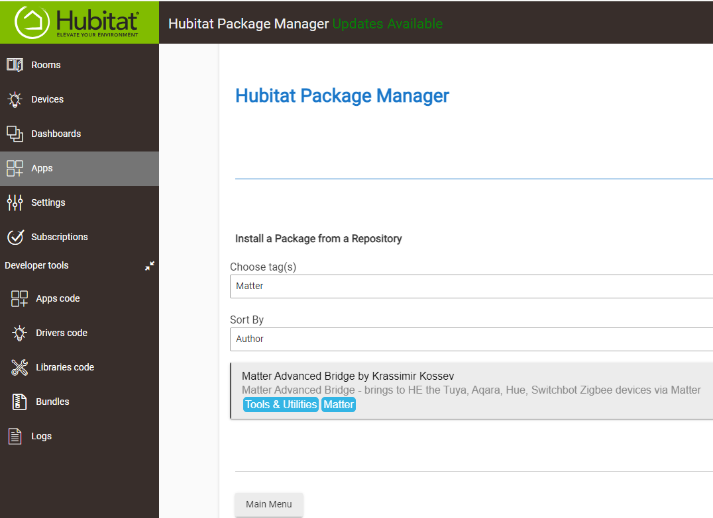
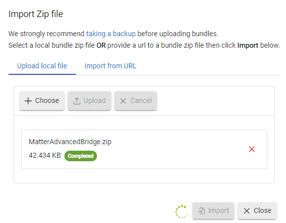
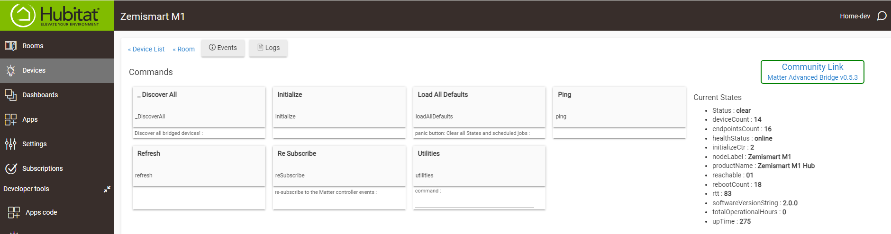
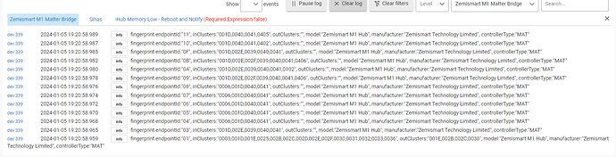
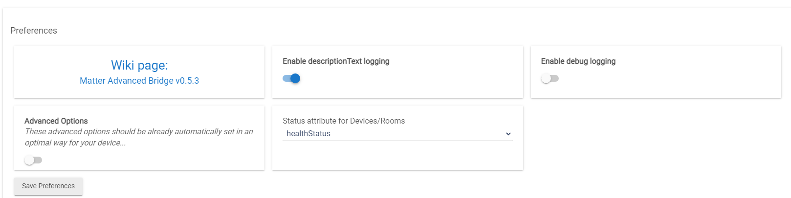
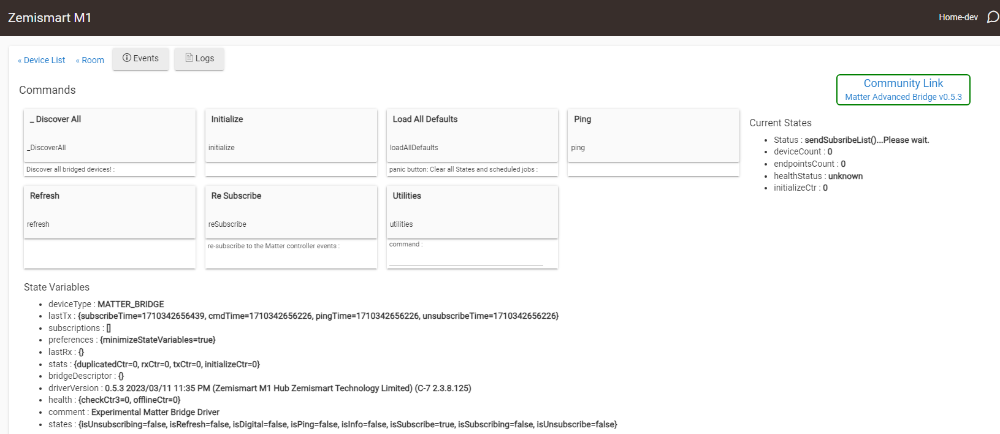
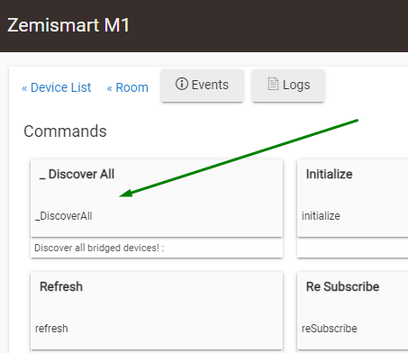
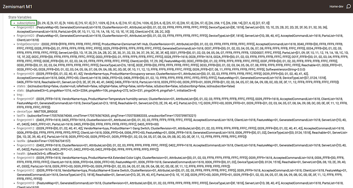

# Installation

Applies to: 1.8.8 | Last verified: 2026-07-27 | Status: Current

Installing this package is two separate jobs: getting the driver code onto your hub, and then
commissioning your Matter bridge and discovering the devices behind it.

## Before you start

- A Matter-capable Hubitat Elevation hub, running platform version **2.3.8.119 or newer**.
- A Matter bridge that is already set up and working in its own manufacturer's app, with at least
  one device paired to it. See [Matter bridges](../bridges/aqara.md) for the bridges people use with
  this package.
- Hubitat Package Manager **1.9.2 or newer**, if you install that way.

## 1. Install the driver package

### Using Hubitat Package Manager (recommended)

In HPM, either **Browse by Tags** → `Matter`, or **Search by Keywords** → `Matter Advanced Bridge`:

The package is a bundle and it is large. Installation can take up to two minutes on an older hub —
let it finish.

### Manual installation

Download the bundle ZIP:

<https://github.com/kkossev/Hubitat---Matter-Advanced-Bridge/raw/main/MatterAdvancedBridge.zip>

**Save the ZIP to your PC first.** Then in Hubitat go to **Bundles** → **Import ZIP** and upload it:

### The BETA bundle

The current release is **1.8.8** — that is what HPM installs, and it is the right choice for most
people.

**1.9.0 is available as a BETA** for anyone who wants to test the newest changes, or who needs a fix
that has not reached the release yet. See the
[revision history](../project/revisions-history.md) for what is in it. Install it the same way as
any manual bundle, using:

<https://github.com/kkossev/Hubitat---Matter-Advanced-Bridge/raw/main/MatterAdvancedBridge_BETA.zip>

A beta is for testing: expect the occasional problem, report what you find in the
[community thread](../help/support-and-links.md), and be ready to reinstall the release bundle if it
does not suit you. Installing the beta over an existing installation keeps your devices and
settings.

## 2. Prepare your Matter bridge

These steps happen in the bridge manufacturer's own app, not in Hubitat. The exact wording differs
per brand, but the sequence is the same for every bridge:

1. **Add the bridge to its own manufacturer's app or account** — Smart Life or Tuya for a Zemismart
   or MOES gateway, the Aqara Home app for an Aqara hub, the Hue app for a Hue bridge, and so on.
2. **Pair at least one device to the bridge.** A bridge with no devices behind it has nothing to
   share with Hubitat, and discovery will find nothing.
3. **Start Matter pairing in that app** and get the Matter commissioning QR code or the 11-digit
   pairing code. Most bridges hide this behind a "share to another Matter ecosystem", "link to
   third-party", or similar option.

Brand-specific notes are on the individual bridge pages:
[Aqara](../bridges/aqara.md) ·
[Philips Hue](../bridges/philips-hue.md) ·
[SwitchBot](../bridges/switchbot.md) ·
[Tuya / Zemismart](../bridges/tuya-zemismart.md) ·
[Other bridges](../bridges/other-bridges.md)

## 3. Commission the bridge to Hubitat

4. **Pair the bridge to Hubitat as a standard Matter device**, using the code from the previous
   step. Hubitat's own Matter documentation covers this part.
5. Hubitat assigns the stock **Device** driver automatically. Click its **Get Info** button; the
   live logs should show at least one fingerprint:

   

6. Change the driver **Type** to **Matter Advanced Bridge** and click **Save Device**, then
   **Save Preferences**:

   

7. Click **Initialize**, then press F5 to refresh the page. It should look like this:

   

## 4. Discover the bridged devices

Discovery is automated — it works out the bridge's own capabilities and those of every device behind
it. Click **_Discover All** and wait for it to finish:

Depending on how many devices are bridged, this can take several minutes.

When it is done, press F5 again. The **Subscriptions** state variable should be populated:

A child device is now created for each bridged endpoint, each with a driver chosen from the clusters
it reports. See [Which driver do I get?](../drivers/index.md) if a child ended up with a driver you
did not expect.

## Next steps

- [Commands and states](../configuration/commands-and-states.md)
- [Preferences](../configuration/preferences.md)
- [Troubleshooting](../help/troubleshooting.md), if discovery found nothing or stalled
