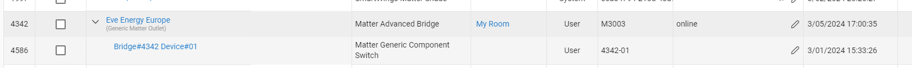

# Using it with Matter devices

Applies to: 1.9.3 | Last verified: 2026-08-22 | Status: Current

As a side effect of how it works, this package can be used not only with Matter **bridges**, but also
with Matter devices paired directly to a Hubitat hub.

That works because a Zigbee device presented by a Matter bridge looks very similar to a native Matter
device paired directly: the same clusters, read the same way.

## How

The steps are the same as for a bridge — see [Installation](installation.md). Pair the device to
Hubitat as a standard Matter device, change its **Type** to `Matter Advanced Bridge`, then
**Initialize** and run **_DiscoverAll**.

The device's endpoints become child devices, exactly as bridged devices do. A single-node device
reports its battery on the root node, and the driver passes that through to the child rather than
leaving it on the parent.

## Devices known to work

| Device | Evidence |
|---|---|
| Aqara U200 smart lock | Confirmed — lock, unlock, and PIN code management, including RFID and UWB operations. See [Door Lock](../drivers/door-lock.md) |
| Aqara U400 smart lock | Confirmed — as above |
| Nuki 4.0 smart lock | Partial — lock, unlock and unbolt only; it advertises credential commands its FeatureMap does not back |
| Aqara Matter Contact Sensor P2 | Reported |
| Eve Energy (Europe) | Reported |
| Nanoleaf A19 Matter | Reported |
| Zemismart Matter Bulb | Reported |

This list is not exhaustive — it is simply what has been tried. A directly-paired Matter device that
reports one of the clusters in [Which driver do I get?](../drivers/index.md) has a good chance of
working.

The three locks are where this route has been pushed hardest: most of the door lock and lock code
work was done against directly-paired locks rather than bridged ones.

## Should you?

Hubitat's own stock drivers handle most directly-paired Matter devices, and for a device they
support properly they are the simpler choice. This package is worth trying when the stock driver
does not expose something the device can actually do.

The locks are a good illustration. Hubitat's platform gained a dedicated Matter lock driver covering
the Aqara U400 and U200, with lock codes through Lock Code Manager, so the stock driver is enough for
most people. This package adds what it does not surface: the operation source behind every lock and
unlock, the lock's alarms and error reasons, and the full cluster dump from **Get Info**.

## Next steps

- [Which driver do I get?](../drivers/index.md)
- [Troubleshooting](../help/troubleshooting.md)
