# Matter Advanced Bridge

Applies to: 1.9.0 BETA | Last verified: 2026-07-27 | Status: Current

A Hubitat Elevation driver package for Matter bridges. The parent driver discovers the devices
behind a Matter bridge, creates one Hubitat child device per endpoint, subscribes to the supported
Matter attributes and events, and routes reports to the children.

It brings Tuya, Aqara, Hue, SwitchBot, and other Zigbee devices to Hubitat over the Matter bridge
protocol. Not every device supported by those hubs will be usable in Hubitat — treat this as an
enthusiast project exploring an alternative way to bring devices from different brands to Hubitat.

- **Author:** Krassimir Kossev (kkossev)
- **License:** Apache 2.0
- **Current release:** 1.8.8 — 1.9.0 is available as a BETA
- **Installation:** via [Hubitat Package Manager](https://community.hubitat.com/t/release-hubitat-package-manager-hpm-hubitatcommunity/94471) — see [Installation](getting-started/installation.md)
- **Community thread:**
  <https://community.hubitat.com/t/release-matter-advanced-bridge-limited-device-support/135252>

Many thanks to everyone who took part in the alpha testing and helped with this project.

> **Documentation is being migrated.** This directory is the new home for user documentation and is
> **not complete yet.** Until it is, the Wiki remains authoritative:
> <https://github.com/kkossev/Hubitat---Matter-Advanced-Bridge/wiki>
> The Wiki will not be deleted; when the migration finishes, its pages will link here.

---

## Documentation

| Section | Pages |
|---|---|
| **Getting started** | [Installation](getting-started/installation.md) · [Using Matter devices](getting-started/use-with-matter-devices.md) |
| **Configuration** | [Preferences](configuration/preferences.md) · [Commands and states](configuration/commands-and-states.md) |
| **Drivers** | [Which driver do I get?](drivers/index.md) · [Matter Advanced Bridge (parent)](drivers/matter-advanced-bridge.md) · [Hubitat stock drivers](drivers/stock-drivers.md) |
| **Compatibility** | [Overview](compatibility/overview.md) · [Device types](compatibility/device-types.md) · [Compatibility matrix](compatibility/matrix.md) |
| **Matter bridges** | [Aqara](bridges/aqara.md) · [Philips Hue](bridges/philips-hue.md) · [SwitchBot](bridges/switchbot.md) · [Tuya / Zemismart](bridges/tuya-zemismart.md) · [Other bridges](bridges/other-bridges.md) |
| **Help** | [Troubleshooting](help/troubleshooting.md) · [Known issues](help/known-issues.md) · [Support and links](help/support-and-links.md) |
| **Project** | [Revision history](project/revisions-history.md) |

The individual driver pages are listed on [Which driver do I get?](drivers/index.md), which also
carries the table mapping each device behind your bridge to the driver it gets.

---

## Matter bridges

Product links below include affiliate links. An entry here is a bridge people have used with this
package — it is not by itself a statement of tested support. For that, see the
[compatibility matrix](compatibility/matrix.md) and the per-bridge pages.

| Brand | Documentation | Where to buy |
|---|---|---|
| **Zemismart M1**<br>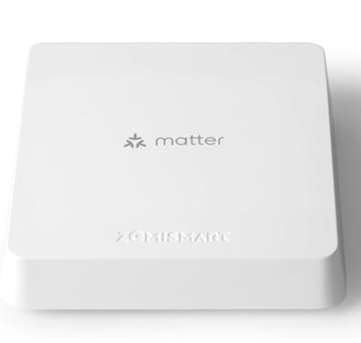 | [Tuya / Zemismart](bridges/tuya-zemismart.md) | [Zemismart.com](https://www.zemismart.com/products/m1?DIST=RkNBHVU=)<br>[Amazon.com](https://amzn.to/4eOIkl1) |
| **Zemismart M6**<br>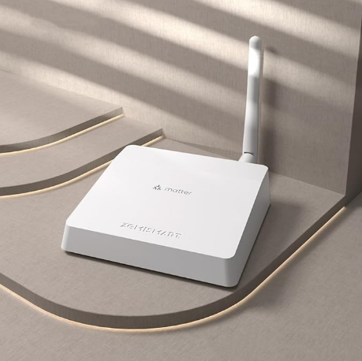 | [Tuya / Zemismart](bridges/tuya-zemismart.md) | [Zemismart.com](https://www.zemismart.com/products/m6?DIST=RkNBHVU=)<br>[Amazon.com](https://amzn.to/3A03MVh) |
| **MOES**<br>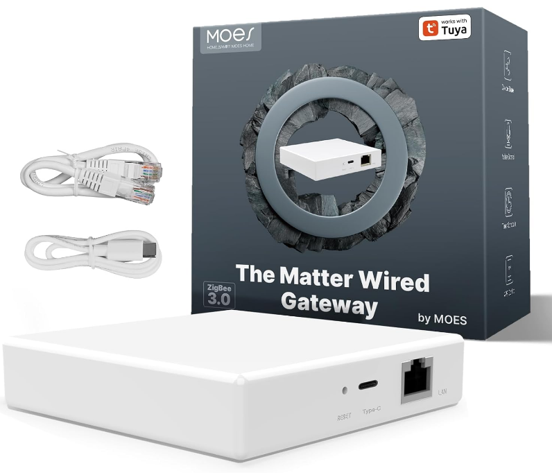 | [Tuya / Zemismart](bridges/tuya-zemismart.md) | [Moeshouse.com](https://moeshouse.com/products/tuya-zigbee-matter-thread-gateway-smart-home-bridge-matter-hub?ref=zxlmpoay&variant=47548663923003)<br>[AliExpress](https://s.click.aliexpress.com/e/_DdlgBxP)<br>[Amazon.de](https://amzn.to/3YwslS3) |
| **Tuya, other brands**<br>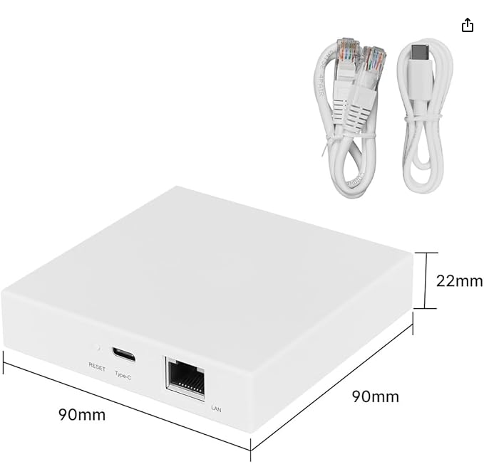 | [Tuya / Zemismart](bridges/tuya-zemismart.md) | [AliExpress](https://s.click.aliexpress.com/e/_DDxf0i1)<br>[AliExpress](https://s.click.aliexpress.com/e/_DkUF6Lx)<br>[AliExpress (GIRIER)](https://s.click.aliexpress.com/e/_DdgepGZ)<br>[Amazon.de](https://amzn.to/3NxzTyw)<br>[Amazon.de](https://amzn.to/409clHT) |
| **Aqara Hub M100**<br>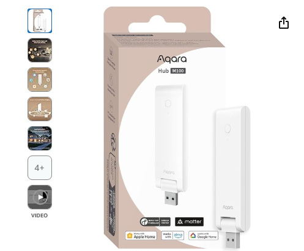 | [Aqara](bridges/aqara.md) | [Amazon](https://geni.us/XQ4q4W) |
| **Aqara Hub E1**<br>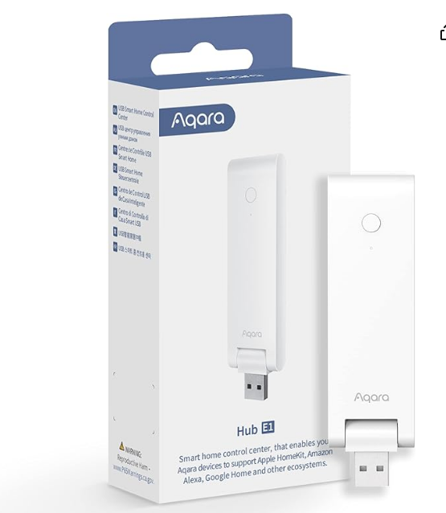 | [Aqara](bridges/aqara.md) | [Amazon.com](https://amzn.to/3YwttVN)<br>[Amazon.co.uk](https://amzn.to/48agOMk)<br>[Amazon.de](https://amzn.to/3Yd9iM3) |
| **Aqara M2**<br>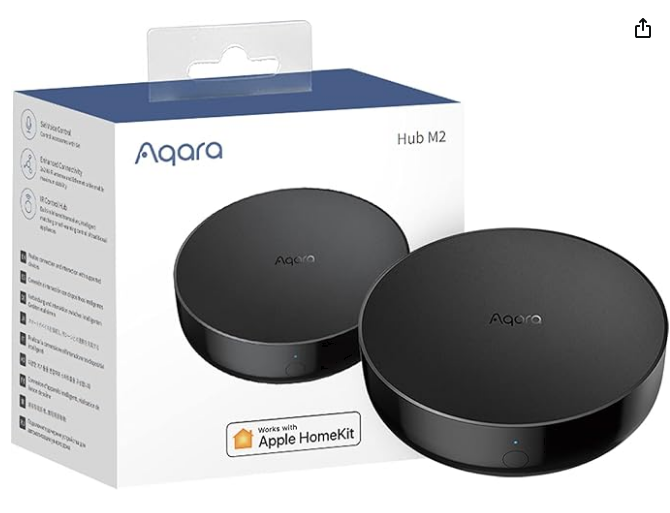 | [Aqara](bridges/aqara.md) | [Amazon.com](https://amzn.to/4f6iDwc)<br>[Amazon.co.uk](https://amzn.to/3Nvqjwk)<br>[Amazon.de](https://amzn.to/4f3CJaZ) |
| **Aqara M3**<br>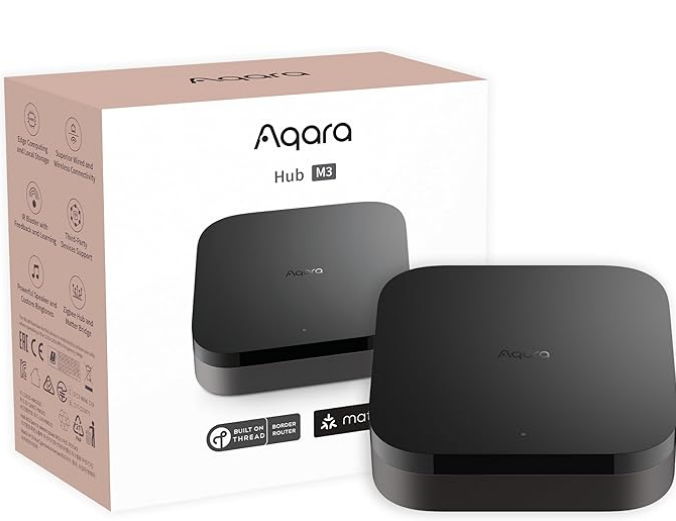 | [Aqara](bridges/aqara.md) | [Amazon.com](https://amzn.to/3BMrBAd)<br>[Amazon.co.uk](https://amzn.to/3BLthKy)<br>[Amazon.de](https://amzn.to/3NxoezU) |
| **Aqara G3**<br>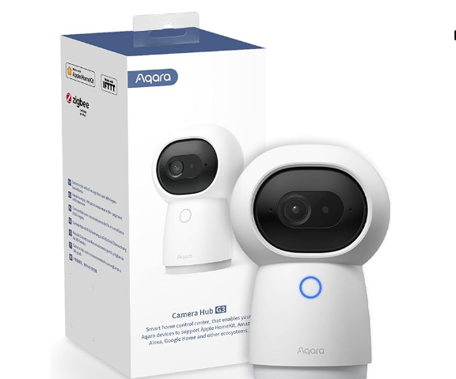 | [Aqara](bridges/aqara.md) | [Amazon.com](https://amzn.to/3Y9A6x0)<br>[Amazon.co.uk](https://amzn.to/3BJwZUM)<br>[Amazon.de](https://amzn.to/3Ys5TKP) |
| **Philips Hue**<br>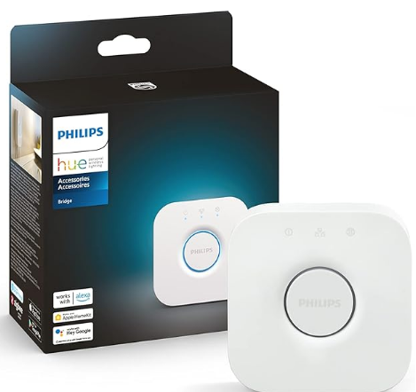 | [Philips Hue](bridges/philips-hue.md) | [Amazon.com](https://amzn.to/40f8clX)<br>[Amazon.co.uk](https://amzn.to/3Y8MkFX)<br>[Amazon.de](https://amzn.to/3NzT9eI) |
| **SwitchBot Hub 2**<br>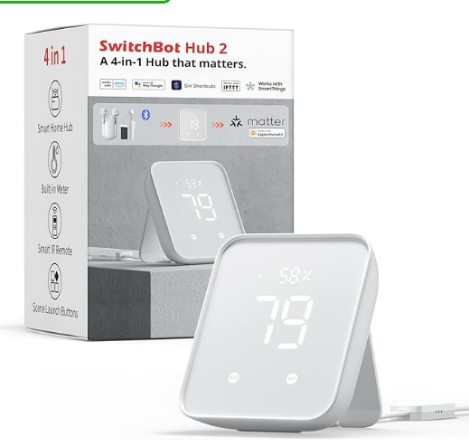 | [SwitchBot](bridges/switchbot.md) | [Amazon.com](https://amzn.to/48eubLz)<br>[Amazon.co.uk](https://amzn.to/3BSzTXt)<br>[Amazon.de](https://amzn.to/4dRoy7d) |
| **Bosch**<br>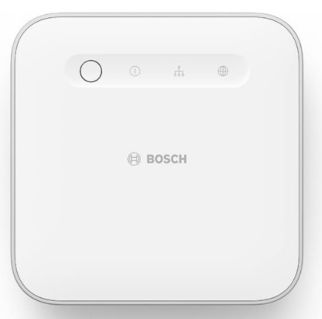 | [Other bridges](bridges/other-bridges.md) | [Amazon.de](https://amzn.to/3Uf4Lb7) |
| **IKEA DIRIGERA**<br>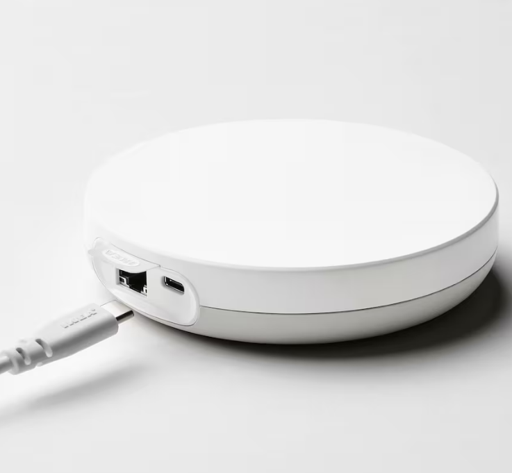 | [Other bridges](bridges/other-bridges.md) | [Ikea.com](https://www.ikea.com/us/en/p/dirigera-hub-for-smart-products-white-smart-50503414/) |
| **Sonoff iHost**<br>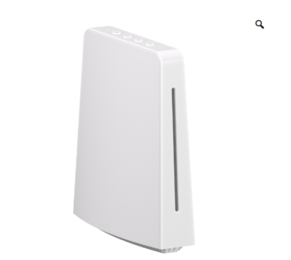 | — | [itead.cc](https://itead.cc/product/sonoff-ihost-smart-home-hub/ref/221/)<br>[Amazon.com](https://amzn.to/3YeO00G)<br>[Amazon.co.uk](https://amzn.to/3Ys2jQK)<br>[Amazon.de](https://amzn.to/3Y8rIhb) |

---

## A note on accuracy

Pages carry a status line:

```text
Applies to: <version> | Last verified: YYYY-MM-DD | Status: Current | Experimental | Historical
```

`Historical` means the content was migrated from the Wiki but has not yet been re-verified against
the current release. Much of the Wiki content dates from March 2024, so treat anything marked
`Historical` as a starting point rather than a current statement of behaviour.

Compatibility claims use explicit evidence labels — **Confirmed**, **Reported**, **Implemented,
unverified**, **Unsupported**, **Unknown**, **Historical** — so that a tested device is
distinguishable from one that merely ought to work.
